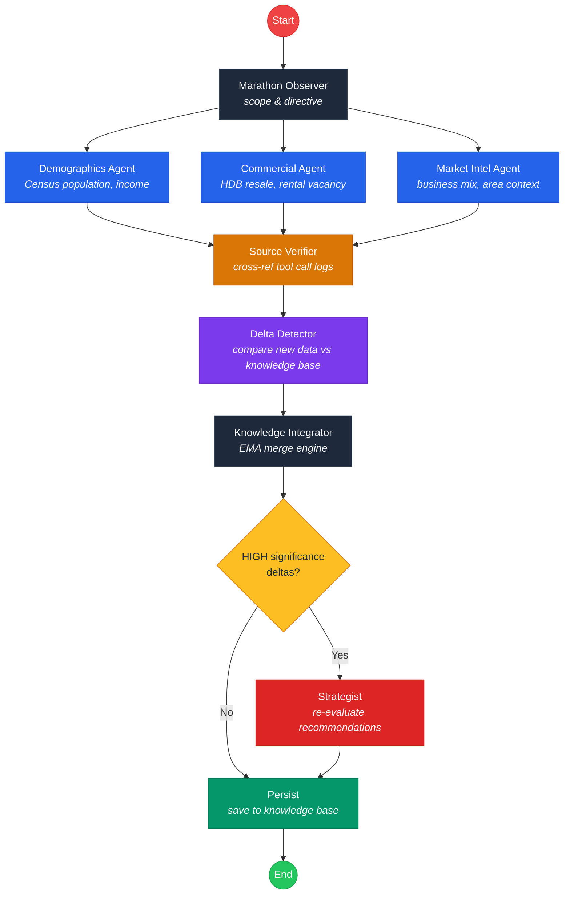

# Heartland Scout SG

An intelligent commercial opportunity scout for Singapore's 27 HDB heartland towns. Uses an agentic AI pipeline to gather real-time data from government open data APIs, detect market shifts, and generate investment-grade business recommendations.

Built for the Gemini 3 Hackathon.

## Quick Start

### Prerequisites

- Node.js 18+
- Python 3.13+
- [uv](https://docs.astral.sh/uv/) (Python package manager)
- A [Google Gemini API key](https://aistudio.google.com/apikey)

### 1. Install dependencies

```bash
# Frontend
cd frontend && npm install

# Backend
cd backend && uv sync
```

### 2. Configure environment

Create `backend/.env`:

```
GEMINI_API_KEY=your-gemini-api-key
```

Optionally, add a [data.gov.sg API key](https://guide.data.gov.sg/developer-guide/api-overview/how-to-request-an-api-key) for higher rate limits:

```
DATAGOV_API_KEY=your-datagov-api-key
```

### 3. Start the backend

```bash
cd backend
uv run uvicorn app.main:app --port 8000 --reload
```

### 4. Start the frontend

```bash
cd frontend
npm run dev
```

Open http://localhost:3000, select a town, and click **Identify Gaps**.

## Features

### Live Agentic Workflow Visualizer

When you trigger a scan, the UI shows a real-time pipeline view. Each agent node transitions through `pending > running > completed`, with tool call badges showing data provenance:

- **VERIFIED** -- Data successfully fetched from source
- **UNAVAILABLE** -- Source API failed; the system will not hallucinate a replacement
- **STALE** -- Using cached data from a previous run

### Anti-Hallucination Source Verification

Every tool call returns a provenance envelope (`fetch_status`, `source_id`, `error`, `raw_url`). The **Source Verifier** agent cross-references all agent claims against actual tool results. If an agent references data from a tool that returned an error, the verifier flags it and downgrades the data point.

### Agent Marathon (Incremental Knowledge Base)

Rather than regenerating analysis from scratch each run, the system maintains an evolving knowledge base per town. Each daily run is a delta operation:

1. **Marathon Observer** checks what data is stale and scopes the run
2. **Delta Detector** compares new findings against the knowledge base
3. **Knowledge Integrator** merges changes using exponential moving averages
4. **Strategist** only re-evaluates recommendations when HIGH-significance changes are detected

This means analysis stabilizes over time rather than fluctuating between runs.

### Investment Dossiers

Each recommendation includes:

- Business profile (size, target audience, strategy, staffing)
- Financial analysis (upfront cost, monthly opex, revenue scenarios)
- Interactive 36-month break-even chart (bear/base/bull cases)
- Suggested expansion clusters and market reference sources

### Custom Dossier Generation

Enter any business type (e.g. "Cat Cafe", "Pilates Studio") in the Targeted Opportunity Scan card to generate a feasibility study grounded in the town's demographics and commercial landscape.

### Run History

Every scout run is recorded with full tool call details, delta counts, and verification reports. Browse past runs in the left sidebar to compare how analysis evolves over time.

## Agentic Workflow

The backend runs a LangGraph StateGraph with parallel fan-out/fan-in:



### Data Sources

All data is sourced from [data.gov.sg](https://data.gov.sg) open APIs (Census 2020, HDB, URA). A shared client (`_datagov.py`) handles rate limiting and retries.

| Source | Agent | Data |
|--------|-------|------|
| Census 2020 (data.gov.sg) | Demographics | Population by age/sex, ethnicity, household income |
| HDB Resale & Commercial (data.gov.sg) | Commercial | Resale transactions, prices, flat type mix |
| URA/HDB Rental (data.gov.sg) | Commercial | Office vacancy rates, HDB median rents |
| data.gov.sg (multiple datasets) | Market Intel | Area context via intent-based dataset routing |

## API Endpoints

| Method | Endpoint | Description |
|--------|----------|-------------|
| `GET` | `/api/scout/{town}/stream` | SSE stream -- runs pipeline with real-time events |
| `GET` | `/api/scout/{town}/analysis` | Latest AreaAnalysis for a town |
| `POST` | `/api/dossier/{town}?business_type=X` | Generate custom business dossier |
| `GET` | `/api/towns` | List all 27 towns with analysis status |
| `GET` | `/api/runs` | Run history (filter by town, limit) |
| `GET` | `/api/runs/{run_id}` | Detailed run info with tool calls and deltas |
| `POST` | `/api/marathon/trigger` | Trigger marathon sweep for all towns |
| `GET` | `/health` | Health check |

## Tech Stack

**Frontend**: React 19, TypeScript, Vite, Recharts, Tailwind CSS

**Backend**: Python 3.13, FastAPI, LangGraph, LangChain, Gemini 2.0 Flash

**Data**: data.gov.sg open APIs, SSE (Server-Sent Events), in-memory knowledge base (Postgres-ready)

## Project Structure

```
sg-heartland-business-scout/
├── frontend/
│   ├── App.tsx                    # UI + WorkflowVisualizer
│   ├── index.html                 # Vite entry HTML
│   ├── index.tsx                  # React DOM mount
│   ├── types.ts                   # TypeScript interfaces
│   ├── constants.tsx              # 27 HDB towns + icons
│   ├── services/
│   │   └── api.ts                 # Backend API client
│   ├── vite.config.ts             # Vite build config
│   ├── tsconfig.json              # TypeScript config
│   └── package.json               # npm dependencies
├── backend/
│   ├── app/
│   │   ├── main.py                # FastAPI + APScheduler
│   │   ├── config.py              # Environment settings
│   │   ├── logging_config.py      # Loguru setup
│   │   ├── agents/
│   │   │   ├── demographics.py    # Census population & income
│   │   │   ├── commercial.py      # HDB resale & rental data
│   │   │   ├── market_intel.py    # Business landscape analysis
│   │   │   ├── source_verifier.py # Provenance cross-reference
│   │   │   ├── marathon_observer.py
│   │   │   ├── delta_detector.py
│   │   │   ├── knowledge_integrator.py
│   │   │   └── strategist.py
│   │   ├── graphs/
│   │   │   ├── scout_graph.py     # Parallel agent pipeline
│   │   │   ├── marathon_graph.py  # Outer marathon loop
│   │   │   └── dossier_graph.py   # Custom dossier generation
│   │   ├── tools/
│   │   │   ├── _datagov.py        # Shared data.gov.sg client
│   │   │   ├── singstat.py        # Census demographics & income
│   │   │   ├── hdb.py             # HDB resale & commercial
│   │   │   ├── ura.py             # Rental & vacancy data
│   │   │   └── web_search.py      # Intent-based dataset router
│   │   ├── models/
│   │   │   ├── schemas.py         # Pydantic models
│   │   │   ├── state.py           # LangGraph state definitions
│   │   │   └── db_models.py       # SQLAlchemy ORM
│   │   └── routers/
│   │       └── scout.py           # API endpoints + SSE
│   └── tests/
│       └── test_tools.py
├── docker-compose.yml             # Postgres (optional)
├── metadata.json
├── LICENSE
└── README.md
```

## Running Tests

```bash
cd backend
uv run pytest tests/ -v
```
