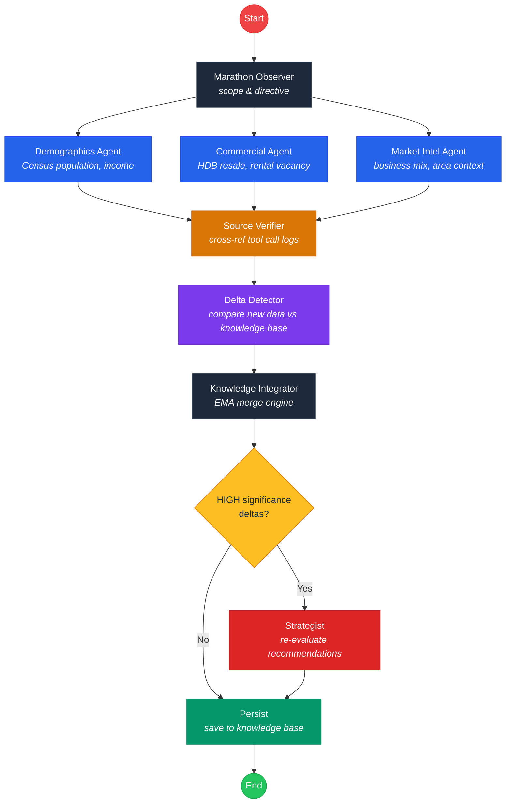

# Heartland Scout SG

An intelligent commercial opportunity scout for Singapore's 27 HDB heartland towns. Uses an agentic AI pipeline to gather real-time data from government open data APIs, detect market shifts, and generate investment-grade business recommendations.

Built for the Gemini 3 Hackathon.


## Demo
https://sg-heartland-scout.pages.dev/

## Quick Start

### Prerequisites

- Node.js 18+
- Python 3.13+
- [uv](https://docs.astral.sh/uv/) (Python package manager)
- A [Google Gemini API key](https://aistudio.google.com/apikey)

### 1. Install dependencies

```bash
# Frontend
cd frontend && npm install

# Backend
cd backend && uv sync
```

### 2. Configure environment

```bash
cp backend/.env.example backend/.env
```

Edit `backend/.env` and add your [Gemini API key](https://aistudio.google.com/apikey). Optionally add a [data.gov.sg API key](https://guide.data.gov.sg/developer-guide/api-overview/how-to-request-an-api-key) for higher rate limits.

### 3. (Optional) Start PostgreSQL

The app uses an in-memory knowledge base by default. To persist data across restarts:

```bash
docker compose up -d
```

Then uncomment the `DATABASE_URL` lines in `backend/.env`.

### 4. Start the backend

```bash
cd backend
uv run uvicorn app.main:app --port 8000 --reload
```

### 5. Start the frontend

```bash
cd frontend
npm run dev
```

Open http://localhost:3000, select a town, and click **Identify Gaps**.

## Features

### Landing Page — Town Overview Dashboard

The landing page shows all 27 HDB towns as cards with live status indicators. Each card displays the town's commercial pulse, wealth tier, population, opportunity count, top opportunity score, and run history. Towns are badged as **Not scanned**, **Cached**, **Stale**, or **Scanned** based on data freshness.

### Live Agentic Workflow Visualizer

When you trigger a scan, the Agent Activity Panel in the sidebar shows real-time pipeline progress. Each agent node transitions through `pending → running → completed`, with tool call counts and live log messages. Click the panel to open the full Pipeline Detail Modal with two views:

- **Activity Log**: Expandable accordion per agent showing tool calls, event timestamps, and LLM output previews
- **Pipeline Graph**: Interactive React Flow DAG with Dagre layout, animated edges, and click-to-inspect node details

Tool call badges show data provenance:

- **VERIFIED** — Data successfully fetched from source
- **UNAVAILABLE** — Source API failed; the system will not hallucinate a replacement
- **STALE** — Using cached data from a previous run

### Wealth & Demographics Intelligence

Each town analysis includes a wealth and demographics panel with:

- Median household income, income per capita, and private property ratio
- Age distribution, employment status, and race composition as animated bar charts
- Residential density estimate
- Wealth tier classification (Mass Market / Upper Mid / Affluent / Silver Economy)

All sourced from Census of Population 2020 via data.gov.sg.

### Strategic Investment Dossiers

Each recommendation card shows a business type, opportunity score, category, and investment thesis. Click to expand the full dossier:

- **Operational Blueprint**: target audience, strategy, scale, staffing, gap analysis
- **Financial Breakdown**: upfront investment, monthly operating cost, estimated rental per sqft
- **Break-Even Horizon Chart**: interactive 36-month cumulative cashflow projection with bear/base/bull scenarios (Recharts LineChart)
- **Expansion Clusters**: suggested locations and market reference links

Filter and sort recommendations by category (F&B, Retail, Wellness, Education, Services), score threshold, startup cost, or revenue potential.

### Custom Dossier Generation

Enter any business type (e.g. "Cat Cafe", "Pilates Studio") in the Targeted Opportunity Scan card to generate a feasibility study grounded in the town's demographics and commercial landscape.

### Anti-Hallucination Source Verification

Every tool call returns a provenance envelope (`fetch_status`, `source_id`, `error`, `raw_url`). The **Source Verifier** agent cross-references all agent claims against actual tool results. If an agent references data from a tool that returned an error, the verifier flags it and downgrades the data point. The Source Grounding section at the bottom of each analysis links to all original data sources.

### Agent Marathon (Incremental Knowledge Base)

Rather than regenerating analysis from scratch each run, the system maintains an evolving knowledge base per town. Each daily run is a delta operation:

1. **Marathon Observer** checks what data is stale and scopes the run (full vs. partial)
2. **Delta Detector** compares new findings against the knowledge base and assigns significance (HIGH / MEDIUM / LOW / NOISE)
3. **Knowledge Integrator** merges changes and updates confidence scores
4. **Strategist** only re-evaluates recommendations when HIGH-significance changes are detected

This means analysis stabilizes over time rather than fluctuating between runs.

### Commercial Pulse Timeline

The sidebar displays a pulse timeline of significant events per town (positive/negative/neutral impacts). Click to expand into a full-screen modal view with the complete event history.

### Open HDB Tenders

The sidebar lists active commercial tenders for the selected town with block number, street, area, closing date, and status (OPEN / LIVE / AWARDED / CLOSED).

### Run History

Every scout run is recorded with full metadata: duration, tool call counts, delta counts, verification stats, and directive type (Cold Start / Incremental). Browse past runs in the sidebar and click to open a detail modal with tool calls, deltas, and the verification report.

### Cache Management

Clear a town's knowledge base and run history via the header button. The app also persists analysis to localStorage and workflow state to sessionStorage for fast reloads.

## Agentic Workflow

The backend runs a two-layer LangGraph StateGraph:

- **Outer loop** (Marathon Graph): observer → scout pipeline → delta detector → knowledge integrator → [conditional: strategist] → persist
- **Inner loop** (Scout Graph): demographics + commercial + market intel agents run in parallel, then fan-in to the source verifier



### Data Sources

All data is sourced from [data.gov.sg](https://data.gov.sg) open APIs (Census 2020, HDB, URA). A shared client (`_datagov.py`) handles rate limiting with exponential backoff retries.

| Source | Agent | Data |
|--------|-------|------|
| Census 2020 (data.gov.sg) | Demographics | Population by age/sex, ethnicity, household income |
| HDB Resale & Commercial (data.gov.sg) | Commercial | Resale transactions, prices, flat type mix |
| URA/HDB Rental (data.gov.sg) | Commercial | Office vacancy rates, HDB median rents |
| data.gov.sg (multiple datasets) | Market Intel | Area context via intent-based dataset routing |

## API Endpoints

| Method | Endpoint | Description |
|--------|----------|-------------|
| `GET` | `/api/scout/{town}/stream` | SSE stream — runs pipeline with real-time events |
| `GET` | `/api/scout/{town}/analysis` | Latest AreaAnalysis for a town |
| `GET` | `/api/scout/{town}/knowledge-base` | Full knowledge base for a town |
| `GET` | `/api/scout/{town}/changelog` | Changelog of detected changes |
| `DELETE` | `/api/scout/{town}/cache` | Clear town's KB and run history |
| `POST` | `/api/dossier/{town}?business_type=X` | Generate custom business dossier |
| `GET` | `/api/towns` | List all 27 towns with analysis status |
| `GET` | `/api/runs` | Run history (filter by `town`, `limit`) |
| `GET` | `/api/runs/{run_id}` | Detailed run with tool calls and deltas |
| `POST` | `/api/marathon/trigger` | Trigger marathon sweep for all towns |
| `GET` | `/health` | Health check |

## Tech Stack

**Frontend**: React 19, TypeScript, Vite, Recharts, React Flow, Tailwind CSS

**Backend**: Python 3.13, FastAPI, LangGraph, LangChain, Gemini 3 Flash, APScheduler

**Data**: data.gov.sg open APIs, SSE (Server-Sent Events), in-memory knowledge base (Postgres-ready)

## Project Structure

```
sg-heartland-business-scout/
├── frontend/
│   ├── App.tsx                    # UI + WorkflowVisualizer
│   ├── index.html                 # Vite entry HTML
│   ├── index.tsx                  # React DOM mount
│   ├── types.ts                   # TypeScript interfaces
│   ├── constants.tsx              # 27 HDB towns + icons
│   ├── services/
│   │   └── api.ts                 # Backend API client
│   ├── vite.config.ts             # Vite build config
│   ├── tsconfig.json              # TypeScript config
│   └── package.json               # npm dependencies
├── backend/
│   ├── .env.example               # Environment variable template
│   ├── app/
│   │   ├── main.py                # FastAPI + APScheduler
│   │   ├── config.py              # Environment settings
│   │   ├── logging_config.py      # Loguru setup
│   │   ├── agents/
│   │   │   ├── demographics.py    # Census population & income
│   │   │   ├── commercial.py      # HDB resale & rental data
│   │   │   ├── market_intel.py    # Business landscape analysis
│   │   │   ├── source_verifier.py # Provenance cross-reference
│   │   │   ├── marathon_observer.py
│   │   │   ├── delta_detector.py
│   │   │   ├── knowledge_integrator.py
│   │   │   └── strategist.py
│   │   ├── graphs/
│   │   │   ├── scout_graph.py     # Parallel agent pipeline
│   │   │   ├── marathon_graph.py  # Outer marathon loop
│   │   │   └── dossier_graph.py   # Custom dossier generation
│   │   ├── tools/
│   │   │   ├── _datagov.py        # Shared data.gov.sg client
│   │   │   ├── singstat.py        # Census demographics & income
│   │   │   ├── hdb.py             # HDB resale & commercial
│   │   │   ├── ura.py             # Rental & vacancy data
│   │   │   └── web_search.py      # Intent-based dataset router
│   │   ├── models/
│   │   │   ├── schemas.py         # Pydantic models
│   │   │   ├── state.py           # LangGraph state definitions
│   │   │   └── db_models.py       # SQLAlchemy ORM
│   │   └── routers/
│   │       └── scout.py           # API endpoints + SSE
│   └── tests/
│       └── test_tools.py
├── docker-compose.yml             # Postgres (optional)
├── metadata.json
├── LICENSE
└── README.md
```

## Running Tests

```bash
cd backend
uv run pytest tests/ -v
```
