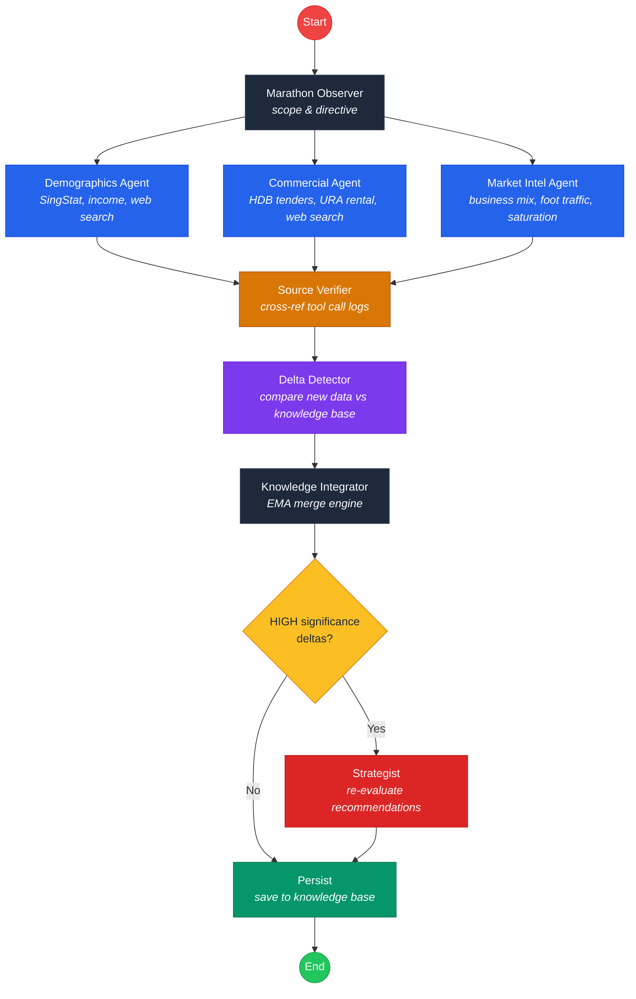

# Heartland Scout SG

An intelligent commercial opportunity scout for Singapore's 27 HDB heartland towns. Uses an agentic AI pipeline to gather real-time data from government registries, detect market shifts, and generate investment-grade business recommendations.

Built for the Gemini 3 Hackathon.

## Quick Start

### Prerequisites

- Node.js 18+
- Python 3.13+
- [uv](https://docs.astral.sh/uv/) (Python package manager)
- A [Google Gemini API key](https://aistudio.google.com/apikey)

### 1. Install frontend dependencies

```bash
npm install
```

### 2. Install backend dependencies

```bash
cd backend
uv sync
```

### 3. Configure environment

Create `backend/.env`:

```
GEMINI_API_KEY=your-gemini-api-key
```

### 4. Start the backend

```bash
cd backend
uv run uvicorn app.main:app --port 8000 --reload
```

### 5. Start the frontend

```bash
npm run dev
```

Open http://localhost:3000, select a town, and click **Identify Gaps**.

## Features

### Live Agentic Workflow Visualizer

When you trigger a scan, the UI replaces the loading spinner with a real-time pipeline view. Each agent node transitions through `pending > running > completed`, with tool call badges showing data provenance:

- **VERIFIED** — Data successfully fetched from source
- **UNAVAILABLE** — Source API failed; the system will not hallucinate a replacement
- **STALE** — Using cached data from a previous run

### Anti-Hallucination Source Verification

Every tool call returns a provenance envelope (`fetch_status`, `source_id`, `error`, `raw_url`). The **Source Verifier** agent cross-references all agent claims against actual tool results. If an agent references data from a tool that returned an error, the verifier flags it and downgrades the data point.

### Agent Marathon (Incremental Knowledge Base)

Rather than regenerating analysis from scratch each run, the system maintains an evolving knowledge base per town. Each daily run is a delta operation:

1. **Marathon Observer** checks what data is stale and scopes the run
2. **Delta Detector** compares new findings against the knowledge base
3. **Knowledge Integrator** merges changes using exponential moving averages
4. **Strategist** only re-evaluates recommendations when HIGH-significance changes are detected

This means analysis stabilizes over time rather than fluctuating between runs.

### Investment Dossiers

Each recommendation includes:

- Business profile (size, target audience, strategy, staffing)
- Financial analysis (upfront cost, monthly opex, revenue scenarios)
- Interactive 36-month break-even chart (bear/base/bull cases)
- Suggested expansion clusters and market reference sources

### Custom Dossier Generation

Enter any business type (e.g. "Cat Cafe", "Pilates Studio") in the Targeted Opportunity Scan card to generate a feasibility study grounded in the town's demographics and commercial landscape.

## Agentic Workflow

The backend runs a LangGraph StateGraph with parallel fan-out/fan-in:



### Data Sources

| Source | Agent | Data |
|--------|-------|------|
| SingStat Table Builder | Demographics | Population, age, race, employment, income |
| HDB Commercial Tenders | Commercial | Active tender listings, block/street/sqft |
| URA Property Market | Commercial | Rental benchmarks per area |
| Google Web Search | All agents | Business mix, foot traffic proxies, saturation |

## API Endpoints

| Method | Endpoint | Description |
|--------|----------|-------------|
| `GET` | `/api/scout/{town}/stream` | SSE stream — runs pipeline with real-time events |
| `GET` | `/api/scout/{town}/analysis` | Latest AreaAnalysis for a town |
| `GET` | `/api/scout/{town}/knowledge-base` | Full knowledge base with confidence scores |
| `GET` | `/api/scout/{town}/changelog` | Change history across marathon runs |
| `POST` | `/api/dossier/{town}?business_type=X` | Generate custom business dossier |
| `GET` | `/api/towns` | List all 27 towns with analysis status |
| `POST` | `/api/marathon/trigger` | Trigger marathon sweep for all towns |
| `GET` | `/health` | Health check |

## Tech Stack

**Frontend**: React 19, TypeScript, Vite, Recharts, Tailwind CSS

**Backend**: Python 3.13, FastAPI, LangGraph, LangChain, Gemini 2.0 Flash

**Data**: SSE (Server-Sent Events), in-memory knowledge base (Postgres-ready)

## Project Structure

```
sg-heartland-business-scout/
├── App.tsx                    # UI + WorkflowVisualizer
├── types.ts                   # TypeScript interfaces
├── constants.tsx              # 27 HDB towns + icons
├── services/
│   └── api.ts                 # Backend API client
├── backend/
│   ├── app/
│   │   ├── main.py            # FastAPI + APScheduler
│   │   ├── config.py          # Environment settings
│   │   ├── agents/
│   │   │   ├── demographics.py
│   │   │   ├── commercial.py
│   │   │   ├── market_intel.py
│   │   │   ├── source_verifier.py
│   │   │   ├── marathon_observer.py
│   │   │   ├── delta_detector.py
│   │   │   ├── knowledge_integrator.py
│   │   │   └── strategist.py
│   │   ├── graphs/
│   │   │   ├── scout_graph.py     # Parallel agent pipeline
│   │   │   ├── marathon_graph.py  # Outer marathon loop
│   │   │   └── dossier_graph.py   # Custom dossier generation
│   │   ├── tools/
│   │   │   ├── web_search.py      # Google search w/ provenance
│   │   │   ├── singstat.py        # SingStat demographics
│   │   │   ├── hdb.py             # HDB tender scraper
│   │   │   └── ura.py             # URA rental scraper
│   │   ├── models/
│   │   │   ├── schemas.py         # Pydantic models
│   │   │   ├── state.py           # LangGraph state definitions
│   │   │   └── db_models.py       # SQLAlchemy ORM
│   │   └── routers/
│   │       └── scout.py           # API endpoints + SSE
│   └── tests/
│       └── test_tools.py
└── docker-compose.yml             # Postgres (optional)
```

## Running Tests

```bash
cd backend
uv run pytest tests/ -v
```
